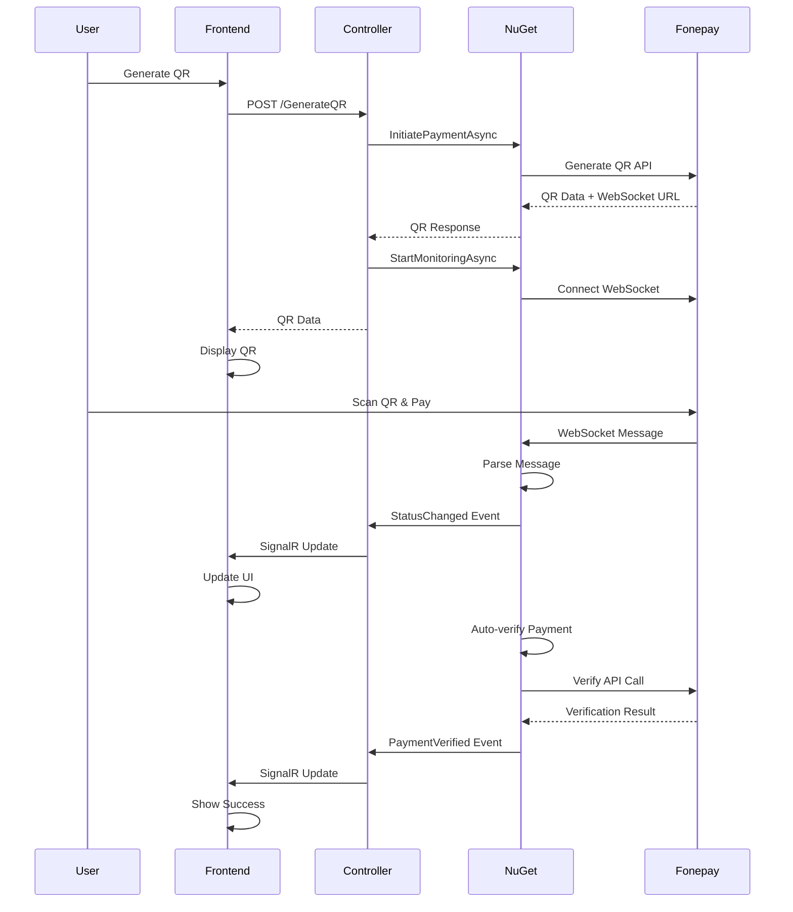

# Fonepay QR Payment Integration Guide

## Overview

This guide demonstrates how to integrate **Fonepay Dynamic QR** payments with **real-time WebSocket monitoring** and **auto-verification** using a complete working implementation.

## Features

- ✅ **Dynamic QR Generation** - Generate QR codes for payments with tax refund support
- ✅ **Real-time WebSocket Monitoring** - Monitor payment status in real-time
- ✅ **Auto-verification** - Automatic payment verification when successful
- ✅ **Payment Status Tracking** - Track QR verification, payment success/failure, and cancellations
- ✅ **SignalR Integration** - Real-time UI updates
- ✅ **Complete Working Example** - Ready-to-use controller and view

## Quick Start

### 1. Install NuGet Package

```bash
dotnet add package Nepal.Payments.Gateways
```

Or via Package Manager Console:
```powershell
Install-Package Nepal.Payments.Gateways
```

Or add to your `.csproj` file:
```xml
<PackageReference Include="Nepal.Payments.Gateways" Version="1.0.1" />
```

## Configuration

```json
// appsettings.json
{
  "PaymentGateways": {
    "SandboxMode": false,
    "Fonepay": {
      "SecretKey": "a7e3512f5032480a83137793cb2021dc",
      "MerchantCode": "NBQM",
      "Username": "9861101076",
      "Password": "admin123456"
    }
  }
}
```

## Implementation

### 1. Program.cs Setup

```csharp
// Program.cs
using Nepal.Payments.Gateways.Extensions;
using Nepal.Payments.Gateways.Demo.Hubs;

var builder = WebApplication.CreateBuilder(args);

// Add MVC
builder.Services.AddControllersWithViews();

// Add Nepal Payment Gateways with WebSocket support
builder.Services.AddNepalPaymentGateways();

// Add SignalR for real-time updates
builder.Services.AddSignalR();

var app = builder.Build();

// Configure pipeline
if (!app.Environment.IsDevelopment())
{
    app.UseExceptionHandler("/Home/Error");
    app.UseHsts();
}

app.UseHttpsRedirection();
app.UseStaticFiles();
app.UseRouting();
app.UseAuthorization();

// Map controllers and SignalR hub
app.MapControllerRoute(
    name: "default",
    pattern: "{controller=Payment}/{action=Index}/{id?}");

app.MapHub<PaymentHub>("/paymentHub");

app.Run();
```

### 2. Create SignalR Hub

```csharp
// Hubs/PaymentHub.cs
using Microsoft.AspNetCore.SignalR;

namespace Nepal.Payments.Gateways.Demo.Hubs
{
    public class PaymentHub : Hub
    {
        public async Task JoinPaymentGroup(string prn)
        {
            await Groups.AddToGroupAsync(Context.ConnectionId, $"payment-{prn}");
        }

        public async Task LeavePaymentGroup(string prn)
        {
            await Groups.RemoveFromGroupAsync(Context.ConnectionId, $"payment-{prn}");
        }
    }
}
```

### 3. Complete Controller Implementation

```csharp
// Controllers/PaymentController.cs
using System.Diagnostics;
using System.Text.Json;
using Microsoft.AspNetCore.Mvc;
using Microsoft.AspNetCore.SignalR;
using Nepal.Payments.Gateways.Demo.Models;
using Nepal.Payments.Gateways.Demo.Hubs;
using Nepal.Payments.Gateways.Enum;
using Nepal.Payments.Gateways.Manager;
using Nepal.Payments.Gateways.Models.Fonepay;
using Nepal.Payments.Gateways.WebSocket;

namespace Nepal.Payments.Gateway.Demo.Controllers
{
    public class PaymentController : Controller
    {
        private readonly ILogger<PaymentController> _logger;
        private readonly IConfiguration _configuration;
        private readonly IHubContext<PaymentHub> _hubContext;
        private readonly IPaymentWebSocketManager _webSocketManager;

        private readonly string _fonepaySecretKey;
        private readonly string _fonepayMerchantCode;
        private readonly string _fonepayUsername;
        private readonly string _fonepayPassword;
        private readonly bool _sandBoxMode;

        public PaymentController(
            ILogger<PaymentController> logger,
            IConfiguration configuration,
            IHubContext<PaymentHub> hubContext,
            IPaymentWebSocketManager webSocketManager)
        {
            _logger = logger;
            _configuration = configuration;
            _hubContext = hubContext;
            _webSocketManager = webSocketManager;

            // Load Fonepay configuration
            _fonepaySecretKey = configuration["PaymentGateways:Fonepay:SecretKey"] ?? "a7e3512f5032480a83137793cb2021dc";
            _fonepayMerchantCode = configuration["PaymentGateways:Fonepay:MerchantCode"] ?? "NBQM";
            _fonepayUsername = configuration["PaymentGateways:Fonepay:Username"] ?? "9861101076";
            _fonepayPassword = configuration["PaymentGateways:Fonepay:Password"] ?? "admin123456";
            _sandBoxMode = configuration.GetValue<bool>("PaymentGateways:SandboxMode", false);

            // Register WebSocket event handlers once during controller construction
            _webSocketManager.StatusChanged += OnStatusChanged;
            _webSocketManager.PaymentVerified += OnPaymentVerified;
            _webSocketManager.PaymentTimeout += OnPaymentTimeout;
            _webSocketManager.PaymentError += OnPaymentError;
            _webSocketManager.PaymentCancelled += OnPaymentCancelled;
        }

        public IActionResult Index()
        {
            return View();
        }

        [HttpPost]
        public async Task<IActionResult> FonepayQr([FromBody] JsonElement body)
        {
            try
            {
                string amount = body.TryGetProperty("amount", out var a) ? a.GetString() ?? string.Empty : string.Empty;
                string remarks1 = body.TryGetProperty("remarks1", out var r1) ? r1.GetString() ?? string.Empty : string.Empty;
                string remarks2 = body.TryGetProperty("remarks2", out var r2) ? r2.GetString() ?? string.Empty : string.Empty;

                if (string.IsNullOrWhiteSpace(amount))
                {
                    return BadRequest(new { success = false, message = "amount is required" });
                }

                var paymentManager = new PaymentManager(
                    paymentMethod: PaymentMethod.FonePay,
                    paymentVersion: PaymentVersion.V2,
                    paymentMode: _sandBoxMode ? PaymentMode.Sandbox : PaymentMode.Production,
                    secretKey: _fonepaySecretKey
                );

                var request = new QrRequest
                {
                    Amount = amount,
                    Remarks1 = remarks1,
                    Remarks2 = remarks2,
                    Prn = Guid.NewGuid().ToString(),
                    MerchantCode = _fonepayMerchantCode,
                    Username = _fonepayUsername,
                    Password = _fonepayPassword
                };

                var response = await paymentManager.InitiatePaymentAsync<dynamic>(request);

                if (response.Success && response.Data != null)
                {
                    var qrResponse = response.Data as QrResponse;
                    if (qrResponse != null)
                    {
                        try
                        {
                            var credentials = new PaymentCredentials
                            {
                                SecretKey = _fonepaySecretKey,
                                MerchantCode = _fonepayMerchantCode,
                                Username = _fonepayUsername,
                                Password = _fonepayPassword,
                                SandboxMode = _sandBoxMode
                            };

                            // Start WebSocket monitoring
                            await _webSocketManager.StartMonitoringAsync(request.Prn, qrResponse.ThirdpartyQrWebSocketUrl, credentials);

                            return Json(new
                            {
                                success = true,
                                prn = request.Prn,
                                qrMessage = qrResponse.QrMessage,
                                message = "QR code generated successfully"
                            });
                        }
                        catch (Exception wsEx)
                        {
                            _logger.LogError(wsEx, "Failed to start WebSocket monitoring");

                            return Json(new
                            {
                                success = true,
                                prn = request.Prn,
                                qrMessage = qrResponse.QrMessage,
                                message = "QR generated but WebSocket failed",
                                error = wsEx.Message
                            });
                        }
                    }
                }

                return BadRequest(new { success = false, message = response.Message ?? "Failed to generate QR code" });
            }
            catch (Exception ex)
            {
                _logger.LogError(ex, "Error initiating Fonepay QR");
                return StatusCode(500, new { success = false, message = "Server error" });
            }
        }

        [HttpPost]
        public async Task<IActionResult> FonepayStatus([FromBody] JsonElement body)
        {
            try
            {
                string prn = body.TryGetProperty("prn", out var p) ? p.GetString() ?? string.Empty : string.Empty;
                if (string.IsNullOrWhiteSpace(prn))
                {
                    return BadRequest(new { success = false, message = "prn is required" });
                }

                var paymentManager = new PaymentManager(
                    paymentMethod: PaymentMethod.FonePay,
                    paymentVersion: PaymentVersion.V2,
                    paymentMode: _sandBoxMode ? PaymentMode.Sandbox : PaymentMode.Production,
                    secretKey: _fonepaySecretKey
                );

                var verificationData = new Dictionary<string, string>
                {
                    ["prn"] = prn,
                    ["merchantCode"] = _fonepayMerchantCode,
                    ["username"] = _fonepayUsername,
                    ["password"] = _fonepayPassword
                };

                var response = await paymentManager.VerifyPaymentAsync<dynamic>(
                    System.Text.Json.JsonSerializer.Serialize(verificationData)
                );

                if (response.Success && response.Data != null)
                {
                    var statusResponse = response.Data as QrStatusResponse;
                    if (statusResponse != null)
                    {
                        return Json(new
                        {
                            success = true,
                            fonepayTraceId = statusResponse.FonepayTraceId,
                            paymentStatus = statusResponse.PaymentStatus,
                            prn = statusResponse.Prn
                        });
                    }
                }

                return BadRequest(new { success = false, message = response.Message ?? "Status check failed" });
            }
            catch (Exception ex)
            {
                _logger.LogError(ex, "Error checking Fonepay status");
                return StatusCode(500, new { success = false, message = "Server error" });
            }
        }

        [HttpPost]
        public async Task<IActionResult> StopWebSocketMonitoring([FromBody] JsonElement body)
        {
            try
            {
                string prn = body.TryGetProperty("prn", out var p) ? p.GetString() ?? string.Empty : string.Empty;
                if (string.IsNullOrWhiteSpace(prn))
                {
                    return BadRequest(new { success = false, message = "prn is required" });
                }

                await _webSocketManager.StopMonitoringAsync(prn);

                return Json(new { success = true, message = "WebSocket monitoring stopped" });
            }
            catch (Exception ex)
            {
                _logger.LogError(ex, "Error stopping WebSocket monitoring");
                return StatusCode(500, new { success = false, message = "Server error" });
            }
        }

    private async Task StartWebSocketMonitoring(string prn, string webSocketUrl, PaymentCredentials credentials)
    {
        // Set up event handlers
        _webSocketManager.StatusChanged += async (sender, args) =>
        {
            await NotifyClient(args.Prn, "STATUS_UPDATE", new
            {
                status = args.PaymentStatus,
                qrVerified = args.QrVerified,
                paymentSuccess = args.PaymentSuccess,
                timestamp = args.Timestamp
            });
        };

        _webSocketManager.PaymentVerified += async (sender, args) =>
        {
            await NotifyClient(args.Prn, args.Success ? "PAYMENT_VERIFIED" : "VERIFICATION_FAILED", new
            {
                success = args.Success,
                verificationData = args.VerificationData,
                errorMessage = args.ErrorMessage,
                timestamp = args.Timestamp
            });
        };

        _webSocketManager.PaymentTimeout += async (sender, args) =>
        {
            await NotifyClient(args.Prn, "PAYMENT_TIMEOUT", new
            {
                timeoutDuration = args.TimeoutDuration,
                timestamp = args.Timestamp
            });
        };

        _webSocketManager.PaymentError += async (sender, args) =>
        {
            await NotifyClient(args.Prn, "PAYMENT_ERROR", new
            {
                errorMessage = args.ErrorMessage,
                timestamp = args.Timestamp
            });
        };

        _webSocketManager.PaymentCancelled += async (sender, args) =>
        {
            await NotifyClient(args.Prn, "PAYMENT_CANCELLED", new
            {
                reason = args.Reason,
                cancelledBy = args.CancelledBy,
                timestamp = args.Timestamp
            });
        };

        // Start monitoring
        await _webSocketManager.StartMonitoringAsync(prn, webSocketUrl, credentials);
    }

    [HttpPost("verify-payment")]
    public async Task<IActionResult> VerifyPayment([FromBody] VerifyPaymentRequest request)
    {
        try
        {
            var paymentManager = new PaymentManager(
                paymentMethod: PaymentMethod.FonePay,
                paymentVersion: PaymentVersion.V2,
                paymentMode: _sandboxMode ? PaymentMode.Sandbox : PaymentMode.Production,
                secretKey: _fonepaySecretKey
            );

            var verificationData = new Dictionary<string, string>
            {
                ["prn"] = request.Prn,
                ["merchantCode"] = _fonepayMerchantCode,
                ["username"] = _fonepayUsername,
                ["password"] = _fonepayPassword
            };

            var response = await paymentManager.VerifyPaymentAsync<PaymentResult>(
                System.Text.Json.JsonSerializer.Serialize(verificationData)
            );

            return Ok(new
            {
                success = response.Success,
                data = response.Data,
                message = response.Message
            });
        }
        catch (Exception ex)
        {
            return StatusCode(500, new { success = false, message = ex.Message });
        }
    }

    [HttpPost("tax-refund")]
    public async Task<IActionResult> ProcessTaxRefund([FromBody] TaxRefundRequest request)
    {
        try
        {
            // Set required fields
            request.MerchantCode = _fonepayMerchantCode;
            request.Username = _fonepayUsername;
            request.Password = _fonepayPassword;

            var paymentService = new Nepal.Payments.Gateways.Services.Fonepay.PaymentService(
                _fonepaySecretKey, 
                _sandboxMode ? PaymentMode.Sandbox : PaymentMode.Production
            );

            var response = await paymentService.ProcessTaxRefundAsync<PaymentResult>(request);

            return Ok(new
            {
                success = response.Success,
                data = response.Data,
                message = response.Message
            });
        }
        catch (Exception ex)
        {
            return StatusCode(500, new { success = false, message = ex.Message });
        }
    }

    private async Task NotifyClient(string prn, string eventType, object data)
    {
        await _hubContext.Clients.Group($"payment-{prn}")
            .SendAsync("PaymentStatusUpdate", new { eventType, data });
    }
}

// Request models
public class VerifyPaymentRequest
{
    public string Prn { get; set; }
}
```

### 3. Frontend Implementation

```html
<!-- Include SignalR -->
<script src="https://unpkg.com/@microsoft/signalr@latest/dist/browser/signalr.min.js"></script>

<script>
let paymentConnection = null;
let currentPrn = null;

// Initialize SignalR connection
async function initializePaymentMonitoring() {
    paymentConnection = new signalR.HubConnectionBuilder()
        .withUrl("/paymentHub")
        .build();

    // Handle payment status updates
    paymentConnection.on("PaymentStatusUpdate", function (update) {
        handlePaymentUpdate(update);
    });

    await paymentConnection.start();
}

// Generate QR and start monitoring
async function generateQR(amount, remarks1, remarks2) {
    try {
        const response = await fetch('/Payment/GenerateQR', {
            method: 'POST',
            headers: { 'Content-Type': 'application/json' },
            body: JSON.stringify({ amount, remarks1, remarks2 })
        });

        const data = await response.json();

        if (data.success) {
            currentPrn = data.prn;
            
            // Join payment group for real-time updates
            await paymentConnection.invoke("JoinPaymentGroup", currentPrn);
            
            // Display QR code
            displayQR(data.qrMessage, currentPrn);
            
            updateStatus("QR Generated - Waiting for scan", "info");
        } else {
            updateStatus("QR Generation Failed", "error");
        }
    } catch (error) {
        updateStatus("Error: " + error.message, "error");
    }
}

// Handle real-time payment updates
function handlePaymentUpdate(update) {
    const { eventType, data } = update;
    
    switch (eventType) {
        case 'STATUS_UPDATE':
            if (data.qrVerified) {
                updateStatus("QR Scanned - Processing payment", "warning");
            }
            if (data.paymentSuccess === true) {
                updateStatus("Payment Successful - Verifying", "success");
            } else if (data.paymentSuccess === false) {
                updateStatus("Payment Failed", "error");
            }
            break;
            
        case 'PAYMENT_VERIFIED':
            updateStatus("Payment Verified Successfully", "success");
            console.log("Verification data:", data.verificationData);
            break;
            
        case 'VERIFICATION_FAILED':
            updateStatus("Payment Verification Failed", "error");
            break;
            
        case 'PAYMENT_TIMEOUT':
            updateStatus("Payment Timeout - Please try again", "warning");
            break;
            
        case 'PAYMENT_ERROR':
            updateStatus("Payment Error: " + data.errorMessage, "error");
            break;
            
        case 'PAYMENT_CANCELLED':
            updateStatus("Payment Cancelled: " + data.reason, "warning");
            break;
    }
}

function updateStatus(message, type) {
    const statusElement = document.getElementById('payment-status');
    statusElement.textContent = message;
    statusElement.className = `status ${type}`;
}

function displayQR(qrMessage, prn) {
    const qrUrl = `https://api.qrserver.com/v1/create-qr-code/?size=300x300&data=${encodeURIComponent(qrMessage)}`;
    document.getElementById('qr-image').src = qrUrl;
    document.getElementById('prn-display').textContent = `PRN: ${prn}`;
}

// Initialize on page load
document.addEventListener('DOMContentLoaded', initializePaymentMonitoring);
</script>
```

## Event Flow



## Error Handling

### Timeout Handling
- **Default timeout**: 15 minutes
- **Event fired**: `PaymentTimeout`
- **Action**: WebSocket connection closed, user notified

### Connection Errors
- **WebSocket failures**: Automatic retry logic
- **Network issues**: Error events with details
- **API failures**: Comprehensive error messages

### Verification Failures
- **Auto-verification fails**: `PaymentVerified` event with `Success = false`
- **Manual verification**: Available via separate endpoint
- **Retry logic**: Built-in retry for transient failures

### QR Generation Signature
- **Without Tax Refund**: `AMOUNT,PRN,MERCHANT-CODE,REMARKS1,REMARKS2`
- **With Tax Refund**: `AMOUNT,PRN,MERCHANT-CODE,REMARKS1,REMARKS2,TAXAMOUNT,TAXREFUND`

### QR Status Signature
- **Format**: `PRN,MERCHANT-CODE`

### Tax Refund Signature
- **Format**: `fonepayTraceId,merchantPRN,invoiceNumber,invoiceDate,transactionAmount,merchantCode`

## Configuration Options

```csharp
// Custom timeout (default: 15 minutes)
await webSocketManager.StartMonitoringAsync(prn, webSocketUrl, credentials, 
    CancellationToken.None);

// Custom PaymentCredentials
var credentials = new PaymentCredentials
{
    SecretKey = "your-secret-key",
    MerchantCode = "your-merchant-code", 
    Username = "your-username",
    Password = "your-password",
    SandboxMode = true // or false for production
};
```


## Testing

### Sandbox Environment
> **Note:** aaile samma chai sandbox chaldaina kya re
- Use `SandboxMode: true` in configuration
- Use test credentials provided by Fonepay
- Test QR codes work with Fonepay mobile app

### Production Environment
- Use `SandboxMode: false`
- Use live credentials from Fonepay
- Ensure proper SSL certificates
- Test with real payments

## Tax Refund Processing

The library supports tax refund processing for completed transactions:

### Usage Example
```csharp
[HttpPost("tax-refund")]
public async Task<IActionResult> ProcessTaxRefund([FromBody] TaxRefundRequest request)
{
    var paymentService = new Nepal.Payments.Gateways.Services.Fonepay.PaymentService(
        secretKey, 
        sandboxMode ? PaymentMode.Sandbox : PaymentMode.Production
    );

    // Set required authentication fields
    request.MerchantCode = merchantCode;
    request.Username = username;
    request.Password = password;

    var response = await paymentService.ProcessTaxRefundAsync<PaymentResult>(request);
    
    return Ok(new
    {
        success = response.Success,
        data = response.Data,
        message = response.Message
    });
}
```

### Tax Refund Request Fields
- **FonepayTraceId**: Original transaction trace ID from Fonepay
- **TransactionAmount**: Original transaction amount
- **MerchantPRN**: Original merchant PRN
- **InvoiceNumber**: Invoice number for the refund
- **InvoiceDate**: Invoice date (format: YYYY-MM-DD)
- **MerchantCode**: Your merchant code
- **Username/Password**: Authentication credentials

### QR Generation with Tax Refund
```csharp
var qrRequest = new QrRequest
{
    Amount = "1000.00",
    Prn = Guid.NewGuid().ToString(),
    Remarks1 = "Payment with tax refund",
    Remarks2 = "Invoice #12345",
    TaxAmount = "130.00",        // Tax amount
    TaxRefund = "Y",             // Enable tax refund
    MerchantCode = merchantCode,
    Username = username,
    Password = password
};
```

## Security Considerations

1. **Credentials Storage**: Store sensitive data in Azure Key Vault or similar
2. **HTTPS Only**: Always use HTTPS in production
3. **Input Validation**: Validate all user inputs
4. **Rate Limiting**: Implement rate limiting for QR generation
5. **Logging**: Log security events but not sensitive data
6. **HMAC Validation**: All requests are automatically signed with HMAC-SHA512
7. **WebSocket Security**: WebSocket connections use secure WSS protocol

## Troubleshooting

### Common Issues

1. **QR Generation Fails**
   - **HMAC Signature Error**: Ensure secret key is correct
   - **Invalid Credentials**: Verify username, password, and merchant code
   - **Missing Required Fields**: Check that Amount, PRN, and MerchantCode are provided
   - **Network Issues**: Verify API endpoint accessibility

2. **WebSocket Connection Fails**
   - **Invalid WebSocket URL**: Ensure `ThirdpartyQrWebSocketUrl` from QR response is used
   - **Firewall Issues**: Check if WSS connections are allowed
   - **SSL Certificate**: Verify certificate validity for secure connections
   - **Connection Timeout**: Default timeout is 15 minutes

3. **Auto-verification Not Working**
   - **Missing Credentials**: Ensure PaymentCredentials are properly set
   - **Event Handler Issues**: Verify event handlers are attached before starting monitoring
   - **API Errors**: Check logs for verification API call failures
   - **JSON Parsing**: Ensure verification data is properly serialized

4. **SignalR Not Updating UI**
   - **Connection State**: Verify SignalR connection is established (`connection.state === "Connected"`)
   - **Group Membership**: Ensure client joined the correct payment group
   - **JavaScript Errors**: Check browser console for errors
   - **Hub Registration**: Verify hub is properly mapped in Program.cs

5. **Tax Refund Processing Fails**
   - **Invalid Trace ID**: Ensure FonepayTraceId is from a successful transaction
   - **Date Format**: Use YYYY-MM-DD format for InvoiceDate
   - **Amount Mismatch**: TransactionAmount should match original transaction
   - **Authentication**: Verify merchant credentials are correct

6. **Payment Status Issues**
   - **QR Not Scanned**: Check if QR code is properly displayed and scannable
   - **Payment Timeout**: Default timeout is 15 minutes, extend if needed
   - **Status Parsing**: Verify WebSocket message parsing logic
   - **Event Handling**: Ensure all event handlers are properly implemented


## Support

For issues related to:
- **NuGet Package**: Create issue in package repository
- **Fonepay API**: Contact Fonepay technical support
- **Integration**: Refer to demo project examples

